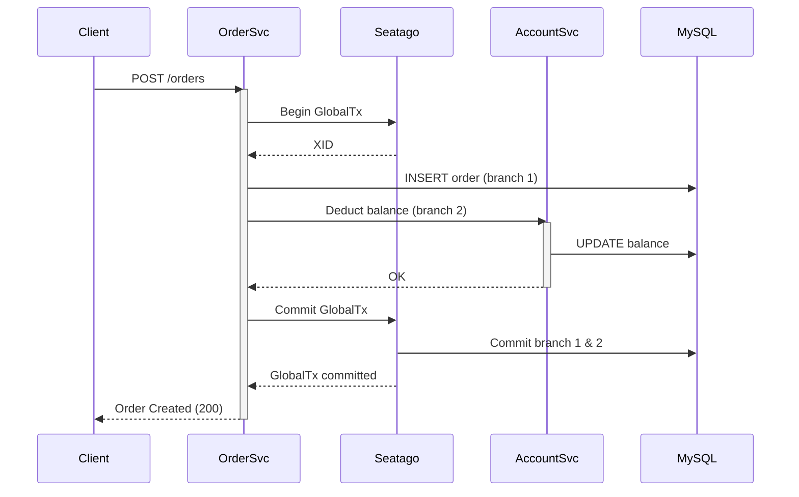

<!--
    Licensed to the Apache Software Foundation (ASF) under one or more
    contributor license agreements.  See the NOTICE file distributed with
    this work for additional information regarding copyright ownership.
    The ASF licenses this file to You under the Apache License, Version 2.0
    (the "License"); you may not use this file except in compliance with
    the License.  You may obtain a copy of the License at

    http://www.apache.org/licenses/LICENSE-2.0
    
    Unless required by applicable law or agreed to in writing, software
    distributed under the License is distributed on an "AS IS" BASIS,
    WITHOUT WARRANTIES OR CONDITIONS OF ANY KIND, either express or implied.
    See the License for the specific language governing permissions and
    limitations under the License.
-->

# Seatago Quick Start

This example project demonstrates how to use Seatago to implement distributed transactions across microservices developed in Go. The sample contains two services:

1. Account Service – manages user account balance
2. Order  Service – creates orders and coordinates money deduction via Seatago AT mode




Directory layout
----------------
```
quick_start/
├── api/          # Protobuf definitions and generated code
├── account/      # Account service implementation
├── order/        # Order service implementation
└── README.md     # (this file)
```

Prerequisites
-------------
1. Go 1.20+
2. Docker & docker-compose
3. Make (optional, just for convenience)

Spin up dependencies
--------------------
The repository already contains a docker-compose file at `dockercompose/docker-compose.yml` that starts:
* MySQL 8.0 with initial schema
* a Seatago coordinator

Run:

```bash
docker compose -f dockercompose/docker-compose.yml up -d
```

Generate protobuf (only required when you change the proto files):

```bash
cd quick_start/api
buf generate
cd ../..
```

Running the services
--------------------

1. Start Account service:

```bash
go run ./quick_start/account/cmd
```

2. Start Order service (in a new terminal):

```bash
go run ./quick_start/order/cmd
```

Executing a sample transaction
------------------------------
After both services are running, create a new order with curl:

```bash
curl -X POST http://localhost:8080/api/v1/orders \
     -H "Content-Type: application/json" \
     -d '{"user_id":1,"amount":100}'
```

You should see logs indicating that Seatago created a global transaction, the order was persisted and the account balance deducted in the same global transaction.

Running tests
-------------
An integration test is provided and can be run with:

```bash
go test ./integrate_test/...
```

Troubleshooting
---------------
* Ensure MySQL is reachable and the DSN in each service's `cmd/db.go` file matches your local environment.
* Check Seatago coordinator logs if a transaction fails to commit.

License
-------
Apache-2.0
