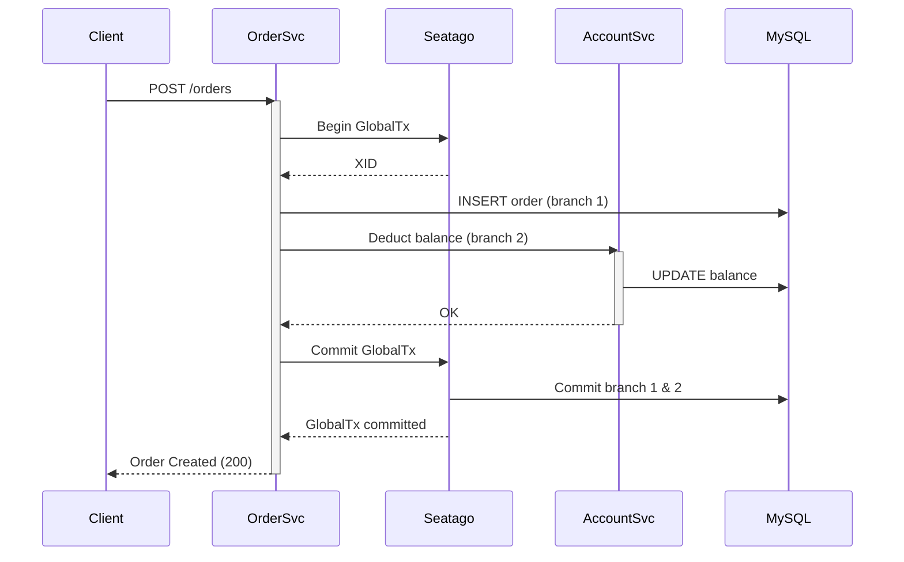

<!--
    Licensed to the Apache Software Foundation (ASF) under one or more
    contributor license agreements.  See the NOTICE file distributed with
    this work for additional information regarding copyright ownership.
    The ASF licenses this file to You under the Apache License, Version 2.0
    (the "License"); you may not use this file except in compliance with
    the License.  You may obtain a copy of the License at

    http://www.apache.org/licenses/LICENSE-2.0
    
    Unless required by applicable law or agreed to in writing, software
    distributed under the License is distributed on an "AS IS" BASIS,
    WITHOUT WARRANTIES OR CONDITIONS OF ANY KIND, either express or implied.
    See the License for the specific language governing permissions and
    limitations under the License.
-->

# Seatago 快速入门

本示例项目演示了如何使用 Seatago 在 Go 微服务之间实现分布式事务。示例包含两个彼此独立的业务服务：

1. **Account Service** – 在本地事务中负责用户账户余额管理  
2. **Order Service** – 在本地事务中创建订单并在 AT 模式下请求扣款  

这两个本地事务通过 Seatago 协调，最终组成一个跨服务的一致性 **分布式事务**。



## 目录结构

```
quick_start/
├── api/          # Protobuf 定义与生成代码
├── account/      # Account 服务实现
├── order/        # Order 服务实现
└── README.md     # (此文件)
```

## 前置条件

1. Go 1.20 及以上  
2. Docker 与 docker-compose  
3. （可选）Make，用于简化命令  

## 启动依赖服务

仓库根目录下的 `dockercompose/docker-compose.yml` 会启动以下组件：

* MySQL 8.0（已包含初始化表结构）
* Seatago 协调器

在项目根目录执行：

```bash
docker compose -f dockercompose/docker-compose.yml up -d
```

## 生成 Protobuf 代码（如修改了 proto 文件才需执行）

```bash
cd quick_start/api
buf generate
cd ../..
```

## 运行两个微服务

1. 启动 Account 服务：

   ```bash
   go run ./quick_start/account/cmd
   ```

2. 另开一个终端，启动 Order 服务：

   ```bash
   go run ./quick_start/order/cmd
   ```

## 体验一次分布式事务

### 简介

1. 预先分配对应的用户账户余额，例如用户 ID 1 初始余额为 100。

```sql
INSERT INTO accounts (user_id, balance) VALUES (1, 100);
```

2. 服务都启动后，使用 curl 创建订单并扣款：

```bash
curl -X POST http://localhost:8080/api/v1/orders \
     -H "Content-Type: application/json" \
     -d '{"user_id":1,"amount":100}'
```

在日志中可以看到 Seatago 创建全局事务 → 订单写库 → 账户扣款 → 全局提交 的完整流程。
3. 当扣款成功后，查询用户账户余额，确认已扣除 100。

```sql
SELECT balance FROM accounts WHERE user_id = 1;
```

4. 确认订单已创建，查询订单表：

```sql
SELECT * FROM orders WHERE user_id = 1;
```
5. 当你创建一个大于当前账户余额的订单，会收到一个错误响应，同时订单未创建, 账户余额也未被修改。

```curl
curl -X POST http://localhost:8080/api/v1/orders \
     -H "Content-Type: application/json" \
     -d '{"user_id":1,"amount":150}'
```

## 源码分析
1. 订单服务：`order`

首先我们在 order 的 service 中开启一个全局的事务, 使用方式是 tm.WithGlobalTx.
在这个 order 中我们还去调用了 account 服务的 Deduct 方法, 这个方法会在全局事务中被协调.

```go
err := tm.WithGlobalTx(ctx, o.config, func(ctx context.Context) error {
    now := time.Now().Unix()
    order.Ctime = now
    order.Utime = now
    err := o.db.WithContext(ctx).Create(&order).Error
    if err != nil {
        return fmt.Errorf("failed to create order: %w", err)
    }

    _, err = o.accountClient.Deduct(ctx, &pb.AccountDeductRequest{
        UserId: order.UserID,
        Money:  order.Money,
    })
    if err != nil {
        return fmt.Errorf("failed to deduct account balance: %w", err)
    }
    return nil
})
```
2. 账户服务：`account`

账户服务是一个 GRPC 服务, 通过 GRPC 的拦截器发挥作用
```go
s := grpc.NewServer(grpc.UnaryInterceptor(seatagrpc.ServerTransactionInterceptor))
pb.RegisterAccountServiceServer(s, server.NewAccountServer(accountService))
```

当然本地也会有一个数据库事务:
```go
err := accountService.Deduct(ctx, req)
```

## 许可证

Apache-2.0